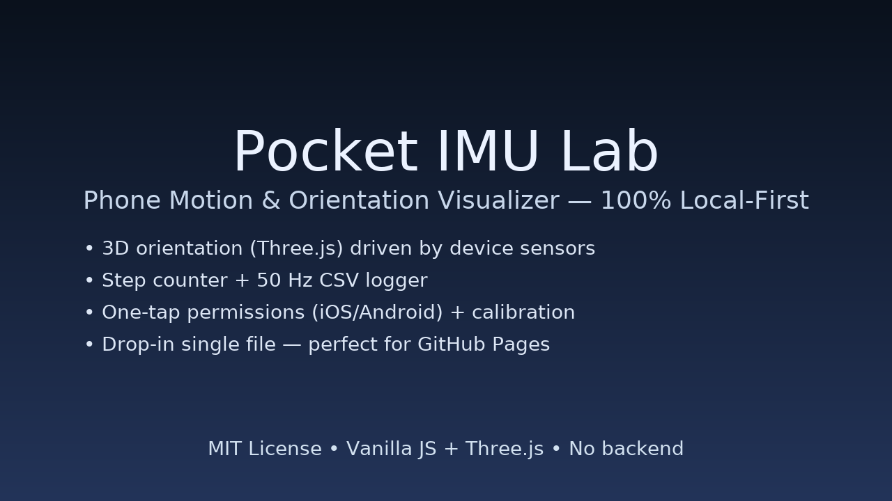

# Pocket IMU Lab

Turn your phone into a mini IMU lab. Visualize orientation in 3D, count steps, and export motion data as CSV — all in a single HTML file you can host on GitHub Pages.



## ✨ Features

* **3D Orientation Viewer** — Real-time phone orientation rendered with Three.js
* **Sensor Permissions UX** — One-tap flow for iOS/Android
* **Calibrate Zero** — Set a custom reference pose
* **Step Counter** — Simple peak detection on acceleration magnitude
* **Data Logger** — 50 Hz sampling; Start/Stop; **Export CSV**
* **Local‑first** — No backend, no API keys; perfect for GitHub Pages

## 🚀 Quick Start

1. Copy `index.html` (in this repo) to your project root.
2. Open it on a **real phone** (sensors are needed).
3. Tap **Enable Sensors** and grant permissions.
4. (Optional) Tap **Calibrate Zero** while holding the phone in your reference pose.
5. Tap **Start** to log; **Export CSV** when done.

> **iOS tip:** On Safari/Chrome iOS, you must explicitly allow Motion & Orientation access when prompted.

## 📁 CSV Format

`imu_log.csv` columns:

```
 t, alpha, beta, gamma, ax, ay, az, steps
 (s) (deg)  (deg) (deg)  (m/s^2)
```

* `t` — seconds since logging start
* `alpha, beta, gamma` — Z‑X‑Y intrinsic angles (DeviceOrientation spec)
* `ax, ay, az` — acceleration (including gravity fallback); units m/s²
* `steps` — running step count from a simple peak detector

## 🧠 How It Works

* **Orientation:** Uses `deviceorientation` (alpha/beta/gamma) and applies calibration offsets before rotating a 3D “phone” model.
* **Steps:** Computes accel magnitude, subtracts \~g, then detects peaks with hysteresis to increment a count. This is intentionally simple and great for improvement PRs.
* **Logging:** A 50 Hz interval samples the latest sensor values into an in‑memory buffer; exports a CSV blob.

## 🛠️ Tech

* **Three.js** (rendering)
* **Tailwind CSS** (styling)
* Vanilla JS (no build tool, no deps)

## 🌐 Deploy to GitHub Pages

1. Create a new repo (e.g., `pocket-imu-lab`).
2. Add `index.html` and this `README.md`.
3. Add `pocket-imu-thumbnail.png` (provided in this repo) for a nice preview.
4. Commit & push.
5. Repo → **Settings** → **Pages** → *Deploy from branch* → `main` → `/ (root)`.
6. Open the Pages URL on your phone.

## 🎯 Ideas for Extensions

* Motion trail for orientation (quaternion or Euler over time)
* Low‑pass/Biquad filtering + step detector improvements
* CSV **import & charting** inside the app
* Map phone orientation to a simple robot arm or camera rig in the scene

## 🤝 Contributing

PRs and issues welcome! Please keep the project dependency‑free.

## 📄 License

MIT — do whatever you want, attribution appreciated.
